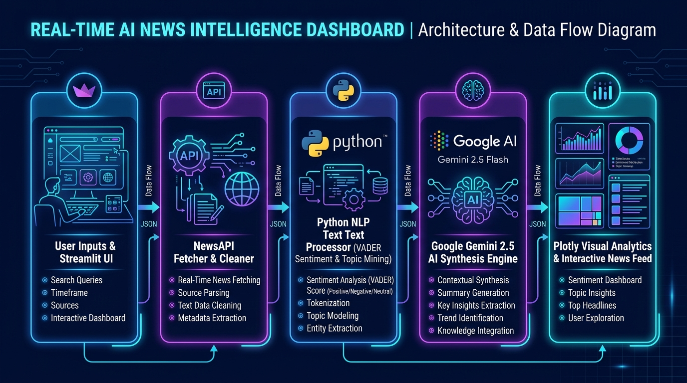
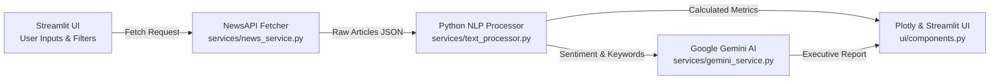

# 📰 Real-Time AI News Intelligence Dashboard

An executive-grade, production-ready **Real-Time AI News Intelligence Dashboard** built with **Python**, **Streamlit**, **NewsAPI**, **Google Gemini AI**, and **Plotly**.

This application curates live global news articles based on keywords and categories, performs local NLP text analytics (VADER sentiment classification, keyword frequency mining, emerging topic clustering), generates executive AI summaries using Google Gemini, and visualizes trends interactively on a modern Streamlit interface.

---

## 📐 System Architecture & Data Flow



### Data Pipeline Overview



1. **User Interaction (Streamlit UI)**: User inputs search queries (keyword, category, volume limit) in the sidebar.
2. **NewsAPI Service (`services/news_service.py`)**: Fetches real-time articles, parses metadata (title, author, publisher, date, image URL, link), and cleans raw responses.
3. **Python NLP Engine (`services/text_processor.py`)**: Performs VADER sentiment analysis, calculates Positive/Neutral/Negative proportions, extracts high-frequency keywords, and identifies bi-gram topic clusters.
4. **Google Gemini Synthesis (`services/gemini_service.py`)**: Synthesizes clean markdown report covering summaries, strategic insights, emerging themes, and sentiment outlooks.
5. **Interactive UI & Visualizations (`ui/components.py`)**: Renders top KPI cards, Plotly donut and bar charts, publication timeline, and responsive news card feed.

---

## ✨ Key Features & Highlights

- **Live News Curation**: Real-time article fetching via NewsAPI filtered by **Keyword** and **Category** (`general`, `technology`, `business`, `sports`, `entertainment`, `health`, `science`).
- **Secure Key Management**: API keys (`NEWS_API_KEY` & `GEMINI_API_KEY`) are stored safely in `.env` and loaded securely in the backend without exposing inputs on the Streamlit UI.
- **NLP Text Analytics**:
  - **Sentiment Analysis**: VADER-powered classification into *Positive*, *Neutral*, and *Negative* categories with compound score evaluation.
  - **Keyword Mining**: Extraction of high-frequency keywords with stopword filtering.
  - **Topic Phrase Extraction**: Auto-detection of multi-word topic clusters from headlines.
- **Google Gemini Executive Synthesis**:
  - 📌 **Executive News Summary**
  - 💡 **Key Insights & Market Signals**
  - 🔥 **Trending Topics & Emerging Themes**
  - ⚖️ **Overall Sentiment & Future Outlook**
- **Modern Dashboard UI Views**:
  - **🏠 Home (News Stream)**: Top summary KPI metrics and searchable grid of news cards featuring thumbnails, author/publisher tags, published date, sentiment badges, and direct article links.
  - **📊 Sentiment & AI Analytics**: Executive Gemini AI report, 5 KPI metric cards, Plotly sentiment donut chart, top keyword frequency graph, news publisher breakdown, and publication volume timeline.
- **Out-of-the-Box Fallback Engine**: Automatically switches to demonstration mode with sample news data if API keys are missing or rate limits occur.

---

## 🛠️ Project Structure

```
d:\AntiGravity\
├── assets/
│   └── architecture_flowchart.jpg  # Architecture & Flow Diagram
├── app.py                          # Main Streamlit dashboard application
├── services/
│   ├── __init__.py
│   ├── news_service.py             # NewsAPI fetching, article cleaner & mock fallback engine
│   ├── text_processor.py           # Sentiment analysis (VADER), keyword & topic phrase miner
│   └── gemini_service.py           # Google Gemini AI prompts, synthesis & fallback engine
├── ui/
│   ├── __init__.py
│   └── components.py               # Header banner, KPI metric cards, Plotly charts & news cards
├── .env                            # Local environment file for API keys (git ignored)
├── .env.example                    # Environment variable configuration template
├── requirements.txt                # Python dependencies
└── README.md                       # Project documentation
```

---

## 🚀 Quickstart Guide

### 1. Prerequisites
- Python 3.9+ installed on your system.

### 2. Install Dependencies
Run the following command in your terminal:

```bash
pip install -r requirements.txt
```

### 3. Configure API Keys

1. Copy `.env.example` to `.env`:
   ```bash
   cp .env.example .env
   ```
2. Open `.env` and add your API keys:
   - **NewsAPI Key**: Get a free API key at [newsapi.org](https://newsapi.org/)
   - **Google Gemini API Key**: Get a free API key at [Google AI Studio](https://aistudio.google.com/)

```env
NEWS_API_KEY=your_news_api_key_here
GEMINI_API_KEY=your_gemini_api_key_here
```

---

## 🏃 Running the Application

Launch the dashboard locally:

```bash
streamlit run app.py
```

The application will open automatically in your web browser at `http://localhost:8501`.

---

## 📊 Dashboard Views & Controls

- **Navigation**:
  - `🏠 Home (News Stream)`: Displays real-time news cards with thumbnail images, author information, published date, sentiment badges, and direct article links.
  - `📊 Sentiment & AI Analytics`: Displays executive AI news intelligence generated by Google Gemini, alongside interactive Plotly charts.
- **Sidebar Filters**:
  - `Keyword Search`: Filter news by specific keywords or entities (e.g., "Artificial Intelligence", "Musk", "Zuckerberg").
  - `Category`: Choose news categories (Technology, Business, Science, etc.).
  - `Number of Articles`: Choose between 10 and 100 articles per fetch.
  - `🔄 Fetch & Refresh News`: Re-fetches live news and recalculates NLP analytics instantly.

---

## 🛡️ Error Handling & Fallbacks

- **Missing/Invalid API Keys**: Automatically displays a friendly banner and loads pre-formatted sample news data so all interactive charts and features remain testable without crashing.
- **NewsAPI Rate Limit (429)**: Notifies the user and preserves current session data seamlessly.
- **Empty Search Results**: Alerts user to broaden search keywords without breaking the layout.
